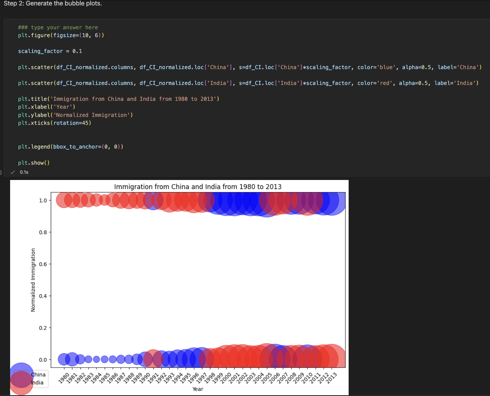

# Assignment 1 - Visualitation Tools

This project is designed to explore and practice various data visualization tools by using the Canada by Citizenship dataset. The primary goal is to generate informative and meaningful plots to better understand the trends and insights within the data.

## Contributing

Name : Muhamad Raihan Syahrin Sya'bani
NIM : 1301213257
Kelas : IF-45-DSIS.

## Screenshots

  <h3>Import Dataset</h3>
  

  <h3>Plot Imigrants from China and India</h3>
  

